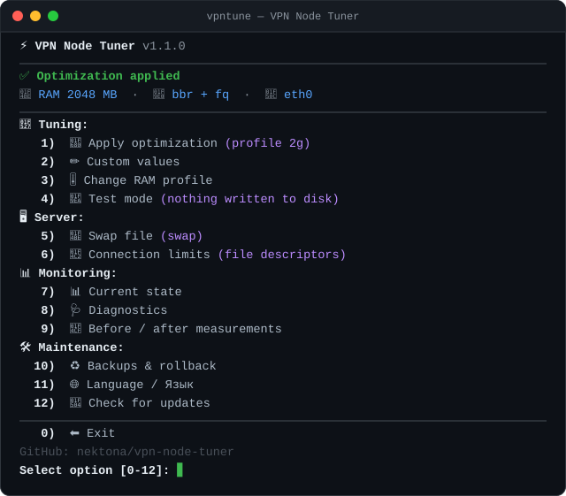

<div align="center">

# ⚡ vpn-node-tuner — network stack tuning for a VPN node

[](#-whats-new)
[](#-requirements)
[](#-requirements)
[](./LICENSE)



**[Install](#-install)** · **[Commands](#-commands)** · **[Profiles](#-profiles-by-ram)** · **[What changes](#-what-changes-and-why)** · **[A/B](#-ab-experiments)** · **[Rollback](#-rollback)** · **[Русский](./README_RU.md)**

</div>

An interactive script that puts `/etc/sysctl.conf` in order for a **VPN node** (Xray / sing-box / 3X-UI / Remnawave): enables **BBR + fq**, sizes buffers and queues **to the server's RAM**, removes outbound port exhaustion and kills the ramp-up stall after a pause in a video player. Plus everything tuning usually falls apart without: swap, file descriptor limits, backups, rollback and diagnostics.

Nothing is applied silently: before writing you get a "current → new" table, a backup is taken, and keys the kernel refuses are removed from the config automatically.

## 🆕 What's new

| Version | Highlights |
|---|---|
| **1.1.0** | New main menu: items grouped into sections, clear names, emoji and hints; the header shows tuning status, RAM, the active congestion control and interface |
| **1.0.0** | First release: 4 RAM profiles, manual mode, A/B experiments, swap, FD limits, diagnostics, backups and rollback, Russian and English menu |

## ⚡ Install

```bash
bash <(curl -Ls https://github.com/nektona/vpn-node-tuner/raw/main/vpn-node-tuner.sh) @ install
```

After installation the script is available as the `vpntune` command:

```bash
sudo vpntune
```

Run once without installing:

```bash
bash <(curl -Ls https://github.com/nektona/vpn-node-tuner/raw/main/vpn-node-tuner.sh)
```

<details>
<summary><b>🚀 Non-interactive mode (mass deployment, Ansible, CI)</b></summary>

```bash
# Apply the auto-detected profile without a single question
sudo vpntune apply --yes

# Force a specific profile
sudo vpntune apply --profile 2g --yes

# Swap of a given size
sudo vpntune swap --size 4G --yes

# FD limits for a specific service
sudo vpntune limits --service remnanode --yes
```

| Option | Description |
|---|---|
| `--profile 1g\|2g\|4g\|8g` | Profile instead of RAM auto-detection |
| `--yes`, `-y` | Ask nothing (every confirmation is "yes") |
| `--lang ru\|en` | Output language |
| `--size <2G>` | Swap file size |
| `--service <name>` | systemd service name for FD limits |
| `--version`, `-v` | Version |
| `--help`, `-h` | Help |

</details>

## 📋 Commands

```bash
vpntune            # interactive menu
```

| Command | Description |
|---|---|
| `install` / `uninstall` | Install as the `vpntune` command / remove (rolls the sysctl.conf block back) |
| `apply` | Apply the tuning: preview → backup → write → verify |
| `status` | What is applied now: profile, every parameter "current vs expected", qdisc, swap |
| `check` | Full diagnostics: conflicts, malformed lines, memory, OOM traces |
| `swap` | Create and enable a swap file, register it in `/etc/fstab` |
| `limits` | File descriptor limits: systemd override + `limits.conf` |
| `baseline` | Kernel state snapshot for before/after comparison |
| `restore` | Roll back from a backup, or remove just this script's block |
| `update` | Update the script to the latest version |

## 🎛 Profiles by RAM

The profile is detected automatically from `MemTotal`; you can override it in the menu (item 3, "🎚️ Change RAM profile") or with `--profile`.

| Profile | RAM | Buffers (max) | `somaxconn` / `syn_backlog` | `netdev_max_backlog` |
|---|---|---|---|---|
| `1g` | < 1.5 GB | 16 MB | 4096 | 8192 |
| `2g` | 1.5–3 GB | 16 MB | 8192 | 16384 |
| `4g` | 3–6 GB | 32 MB | 16384 | 32768 |
| `8g` | > 6 GB | 64 MB | 32768 | 65536 |

All other parameters are identical across profiles.

> **Why 16 MB and not 64 on a small server.** 16 MB is enough for one client to saturate a gigabit link even at RTT ≈ 120 ms (BDP ≈ 1 Gbit/s × 0.12 s ≈ 15 MB). 64 MB on a 1 GB server is a direct path to the OOM killer taking out Xray at peak load. The maximum is not reserved upfront, but with many active connections memory goes fast.

## 🔧 What changes, and why

### Congestion control and queueing

| Parameter | Value | Why on a VPN node |
|---|---|---|
| `net.ipv4.tcp_congestion_control` | `bbr` | Estimates real bandwidth and RTT instead of reacting to loss alone. On lossy links it is noticeably faster and steadier than the default `cubic` |
| `net.core.default_qdisc` | `fq` | The standard companion for BBR: without pacing BBR performs worse |

If `bbr` is unavailable in the kernel, the script says so and offers `cubic` — the rest of the tuning still applies.

`default_qdisc` only affects interfaces brought up **after** it is set, so the script attaches the qdisc to the default interface immediately via `tc qdisc replace` — no reboot needed.

### Socket buffers

| Parameter | Meaning |
|---|---|
| `net.ipv4.tcp_rmem` / `tcp_wmem` | Three values in bytes: `<min> <default> <max>`. The kernel autotunes within these bounds |
| `net.core.rmem_max` / `wmem_max` | System-wide ceiling: the most an application may request manually |

### Idle behaviour

| Parameter | Value | What it does |
|---|---|---|
| `net.ipv4.tcp_slow_start_after_idle` | `0` | Does not reset the congestion window after an idle period. For multiplexed gRPC / HTTP-2 / XHTTP connections that stay open for hours, this is what removes the ramp-up stall when Reels/TikTok resume after a pause |

### Queues and ports

| Parameter | Value | Meaning |
|---|---|---|
| `net.core.somaxconn` | per profile | Queue of established connections not yet accepted by the application |
| `net.ipv4.tcp_max_syn_backlog` | per profile | Queue of half-open (SYN) connections |
| `net.core.netdev_max_backlog` | per profile | Packet queue between the NIC and kernel processing |
| `net.ipv4.ip_local_port_range` | `1024 65535` | Xray opens an outbound connection per client request — the default ~28k ports may not be enough |
| `net.ipv4.tcp_tw_reuse` | `1` | Reuse of `TIME_WAIT` sockets for outbound connections. Safe for a node, removes port exhaustion |
| `net.ipv4.tcp_fin_timeout` | `15` | Frees `FIN_WAIT_2` sockets faster |
| `net.ipv4.tcp_keepalive_*` | `600 / 30 / 5` | Reaps dead client sessions faster |

> ⚠️ The script **never writes** `net.ipv4.tcp_tw_recycle`: it broke NAT clients and was removed from the kernel in 4.12. If it is found in your config, the script warns about it. Any guide that still recommends it is out of date.

### Memory

| Parameter | Value | Meaning |
|---|---|---|
| `vm.swappiness` | `10` | Swap only under real pressure, not "just in case" |
| `vm.vfs_cache_pressure` | `50` | Keep the dentry/inode cache in memory longer |

## ✍️ Manual values

Menu item **2 · ✏️ Custom values** walks through every parameter, showing the current value, the profile suggestion and a one-line explanation of what the parameter does.

- `Enter` — accept the suggestion
- `-` — **do not set** this parameter at all (the kernel default stays)
- any value — write your own

The result is stored in `/etc/vpn-node-tuner/params.conf` and reused by the next `vpntune apply`, so a per-client tuning only has to be done once.

## 🧪 A/B experiments

Menu item **4 · 🧪 Test mode**. Values are applied at runtime via `sysctl -w`, **nothing is written to disk** and everything resets on reboot — which is exactly how a controversial parameter should be tested.

| What to try | When it helps |
|---|---|
| `fq_codel` instead of `fq` | On some VPS (KVM/VirtIO, especially oversold) pacing in `fq` conflicts with the virtual NIC queues and adds latency |
| `cubic` instead of `bbr` | If the provider shapes or polices traffic, BBR may not pay off |
| `tcp_notsent_lowat` = 131072 / 262144 / 32768 | Against bufferbloat. A shorter queue means lower latency under load, but an aggressive value can cut peak speed on a gigabit link |
| `tcp_mtu_probing` = 1 | If connections establish but large transfers stall — Path MTU Discovery problems |

The routine is always the same: apply → restart Xray → reconnect the client → measure. A separate item persists a winning combination into `/etc/sysctl.conf`.

> Do not keep a parameter "because the guide said so". If you cannot see a difference in the measurements, the kernel default is perfectly reasonable too.

## 💾 Swap and FD limits

**Swap** (item 5) does not make the server faster — it keeps the OOM killer from taking out Xray during a short spike. On 1 GB RAM without swap, a service crash is only a matter of time. The script creates a swap file (`fallocate`, falling back to `dd`), enables it and registers it in `/etc/fstab`.

**FD limits** (item 6). Every client connection is at least one descriptor; the default 1024 runs out at a few dozen active clients and the log fills with `too many open files`. The script finds the service (`xray`, `sing-box`, `x-ui`, `remnanode`, `hysteria`, `marzban`), creates a systemd override with `LimitNOFILE=1048576` and shows the actual limit from `/proc/PID/limits` — not what it should be, but what it is.

> `limits.conf` applies to interactive sessions via PAM and does **not** apply to systemd services — which is why the override is mandatory. If the node runs in Docker, the script prints the `ulimits` snippet for `docker-compose.yml`.

## ♻️ Rollback

A backup `/etc/sysctl.conf.bak-YYYY-MM-DD-HHMMSS` is taken before every write (the last 10 are kept). Menu item **10 · ♻️ Backups & rollback**:

- restore `/etc/sysctl.conf` from any backup;
- remove **only** the `vpn-node-tuner` block, leaving the rest of the file alone;
- show what is currently written inside the block.

```bash
sudo vpntune restore
```

Kernel values stay active until reboot — a `reboot` is needed to reset the qdisc reliably.

## 📊 How to measure

Tuning without a baseline is pointless: you cannot tell an improvement from a coincidence. Menu item **9 · 📏 Before / after measurements** takes a kernel state snapshot and prints the commands to run **from the client**:

```bash
ping -c 100 SERVER_IP | tail -3         # watch mdev — that is what you feel as stutter
mtr -rwzbc 100 SERVER_IP                # route and per-hop loss
iperf3 -c SERVER_IP -p 5201 -P 8 -t 20  # throughput and Retr
```

Plus a bufferbloat test (`waveform.com/tools/bufferbloat`) — target **Grade A/A+** with latency under load rising no more than +5…+15 ms.

> The reference number is not a one-off ping but the **median of a 100-packet series**, taken before and after from the same place, ideally twice (morning and evening): backbone load moves RTT more than any sysctl. A one-off "3 ms to an overseas VPS" is almost always a local device or cache answering, not your server.

## 🛠 How the script edits the file

Everything goes into `/etc/sysctl.conf` as a single block between markers:

```ini
# ===== vpn-node-tuner (start) =====
...
# ===== vpn-node-tuner (end) =====
```

- on a repeated run the **old block is replaced as a whole** — the file does not grow;
- the same keys set **earlier in the file** are commented out automatically with a `# [vpn-node-tuner: disabled duplicate]` tag, so the "last occurrence wins" rule stops being a surprise;
- `/etc/sysctl.conf` is read **last** by `sysctl --system` and overrides `/etc/sysctl.d/` — the script still reports who else touches the same keys;
- keys the kernel refuses (`cannot stat`, `Invalid argument`, a container without privileges) are dropped from the file automatically, with an explicit list in the output.

## ❓ Common problems

| Symptom | Likely cause | What to do |
|---|---|---|
| A parameter does not show up in `sysctl <name>` | The line ran into a comment | Item 8 · 🩺 Diagnostics → "Malformed lines" |
| `sysctl: cannot stat /proc/sys/...` | The parameter is absent from this kernel, or the server is an LXC/OpenVZ container | The script drops such keys itself and lists them |
| Xray killed by the OOM killer | Buffers too large for this RAM and/or no swap | A smaller profile (`--profile 1g`) + swap (item 5) |
| Bufferbloat grade C/D | Bloated transmit queues | Item 4: `fq_codel`, then `tcp_notsent_lowat = 131072` |
| Ping got worse after `fq` | Pacing conflicts with the VPS virtual NIC | Item 4: `fq_codel` |
| Speed did not improve at all | Capped by the VPS link or by CPU on encryption | Run `top` under load: if one core sits at 100 %, sysctl is not the problem |
| `too many open files` in the log | Service FD limit | Item 6 |
| Stutter after a pause in the player | TCP window reset while idle | Verify `tcp_slow_start_after_idle = 0` is actually applied (item 7 · 📊 Current state) |
| `tc qdisc show` reports `pfifo_fast` | Interface came up before `default_qdisc` was set | Item 1 attaches the qdisc right away; otherwise `reboot` |

## 🚫 What this script will NOT do

- **It will not increase the bandwidth you bought.** A 100 Mbit/s VPS stays 100 Mbit/s.
- **It will not help if you are CPU-bound.** On a single core, Reality/TLS encryption tops out somewhere in the few-hundred-Mbit/s range.
- **It will not fix a bad route.** If `mtr` shows loss on a transit hop, that is for the provider — or for a different node location.
- **It will not change UDP traffic** (Hysteria2 / TUIC): those have their own buffers — `net.core.rmem_max` matters, `tcp_*` does not.
- **It will not replace measurement.** The values are a starting point, not dogma.

## 📦 Requirements

- Ubuntu 20.04+ / Debian 11+ (stock kernel, no XanMod or other third-party kernels), bash 4.0+
- root (via `sudo`)
- `curl` for install and update; `tc` (package `iproute2`) to attach the qdisc without a reboot

Inside LXC/OpenVZ containers some network sysctls are unavailable — the script detects the container, warns, and applies whatever the kernel accepts.

## 📄 License

[MIT](./LICENSE) — take it, change it, use it.
