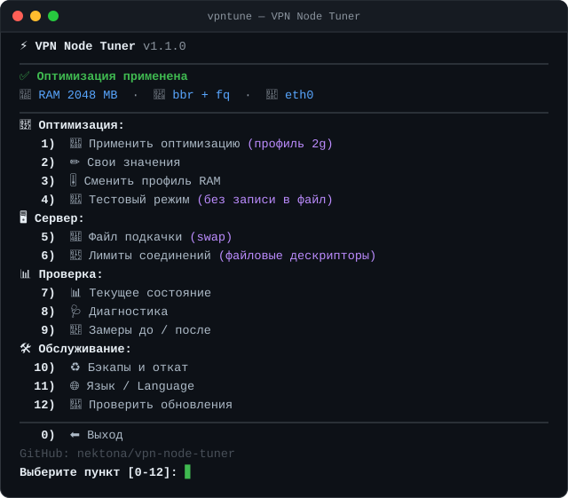

<div align="center">

# ⚡ vpn-node-tuner — тюнинг сетевого стека для VPN-ноды

[](#-что-нового)
[](#-требования)
[](#-требования)
[](./LICENSE)



**[Установка](#-установка)** · **[Команды](#-команды)** · **[Профили](#-профили-по-ram)** · **[Что меняется](#-что-именно-меняется-и-зачем)** · **[A/B](#-ab-эксперименты)** · **[Откат](#-откат)** · **[English](./README.md)**

</div>

Интерактивный скрипт, который приводит `/etc/sysctl.conf` в порядок под **VPN-ноду** (Xray / sing-box / 3X-UI / Remnawave): включает **BBR + fq**, подбирает буферы и очереди **под объём RAM сервера**, снимает исчерпание портов и убирает «раскачку» после паузы в плеере. Плюс всё, без чего тюнинг обычно разваливается: swap, лимиты файловых дескрипторов, бэкапы, откат и диагностика.

Ничего не применяется молча: перед записью показывается таблица «сейчас → станет», делается бэкап, а ключи, которые ядро не приняло, автоматически убираются из конфига.

## 🆕 Что нового

| Версия | Главное |
|---|---|
| **1.2.0** | Новый тестовый режим: профиль или отдельные параметры включаются на время теста, сервер сам меряет ваше соединение, таблица A/B и выбор «вернуть / оставить», автооткат при Ctrl+C и обрыве SSH. Все подменю оформлены как главное. Исправлено обновление (меню оставалось на старой версии) и невидимые вопросы в swap, лимитах и откате |
| **1.1.0** | Новое главное меню: пункты сгруппированы по разделам, понятные названия, эмодзи и подсказки; в шапке — статус оптимизации, RAM, текущие алгоритм и интерфейс |
| **1.0.0** | Первый релиз: 4 профиля по RAM, ручной режим, A/B-эксперименты, swap, лимиты FD, диагностика, бэкапы и откат, меню на русском и английском |

## ⚡ Установка

```bash
bash <(curl -Ls https://github.com/nektona/vpn-node-tuner/raw/main/vpn-node-tuner.sh) @ install
```

После установки скрипт доступен как команда `vpntune`:

```bash
sudo vpntune
```

Запустить один раз, без установки в систему:

```bash
bash <(curl -Ls https://github.com/nektona/vpn-node-tuner/raw/main/vpn-node-tuner.sh)
```

<details>
<summary><b>🚀 Неинтерактивный режим (массовый деплой, Ansible, CI)</b></summary>

```bash
# Применить автопрофиль без единого вопроса
sudo vpntune apply --yes

# Принудительно задать профиль
sudo vpntune apply --profile 2g --yes

# Swap заданного размера
sudo vpntune swap --size 4G --yes

# Лимиты FD для конкретного сервиса
sudo vpntune limits --service remnanode --yes
```

| Опция | Описание |
|---|---|
| `--profile 1g\|2g\|4g\|8g` | Профиль вместо автоопределения по RAM |
| `--yes`, `-y` | Не задавать вопросов (все подтверждения — «да») |
| `--lang ru\|en` | Язык вывода |
| `--size <2G>` | Размер swap-файла |
| `--service <name>` | Имя systemd-сервиса для лимитов FD |
| `--version`, `-v` | Версия |
| `--help`, `-h` | Справка |

</details>

## 📋 Команды

```bash
vpntune            # интерактивное меню
```

| Команда | Описание |
|---|---|
| `install` / `uninstall` | Установить как команду `vpntune` / удалить (с откатом блока в sysctl.conf) |
| `apply` | Применить тюнинг: превью изменений → бэкап → запись → проверка |
| `status` | Что применено сейчас: профиль, каждый параметр «текущее vs ожидаемое», qdisc, swap |
| `check` | Полная диагностика: конфликты, битые строки, память, следы OOM |
| `swap` | Создать и подключить swap-файл, прописать в `/etc/fstab` |
| `limits` | Лимиты файловых дескрипторов: systemd-override + `limits.conf` |
| `baseline` | Снимок состояния ядра для сравнения «до / после» |
| `restore` | Откат из бэкапа или удаление только своего блока |
| `update` | Обновить скрипт до последней версии |

## 🎛 Профили по RAM

Профиль определяется автоматически по `MemTotal`; в меню (пункт 3 «🎚️ Сменить профиль RAM») или флагом `--profile` его можно переопределить.

| Профиль | RAM | Буферы (max) | `somaxconn` / `syn_backlog` | `netdev_max_backlog` |
|---|---|---|---|---|
| `1g` | < 1.5 ГБ | 16 МБ | 4096 | 8192 |
| `2g` | 1.5–3 ГБ | 16 МБ | 8192 | 16384 |
| `4g` | 3–6 ГБ | 32 МБ | 16384 | 32768 |
| `8g` | > 6 ГБ | 64 МБ | 32768 | 65536 |

Остальные параметры одинаковы во всех профилях.

> **Почему 16 МБ, а не 64, на слабом сервере.** 16 МБ хватает, чтобы один клиент выбрал гигабитный канал даже при RTT ≈ 120 мс (BDP ≈ 1 Гбит/с × 0,12 с ≈ 15 МБ). А 64 МБ на сервере с 1 ГБ RAM — прямой путь к OOM-killer, который убьёт Xray ровно в пик нагрузки. Максимум не резервируется сразу, но при большом числе активных соединений память уходит быстро.

## 🔧 Что именно меняется и зачем

### Алгоритм перегрузки и планировщик очередей

| Параметр | Значение | Зачем на VPN-ноде |
|---|---|---|
| `net.ipv4.tcp_congestion_control` | `bbr` | Оценивает реальную полосу и RTT вместо реакции только на потери. На каналах с потерями даёт заметно выше и стабильнее скорость, чем дефолтный `cubic` |
| `net.core.default_qdisc` | `fq` | Штатная пара для BBR: без pacing BBR работает хуже |

Если `bbr` в ядре недоступен, скрипт скажет об этом и предложит `cubic` — остальной тюнинг при этом применится.

`default_qdisc` действует только на интерфейсы, поднятые **после** его установки, поэтому скрипт сразу навешивает qdisc на дефолтный интерфейс через `tc qdisc replace` — без перезагрузки.

### Буферы сокетов

| Параметр | Смысл |
|---|---|
| `net.ipv4.tcp_rmem` / `tcp_wmem` | Три числа в байтах: `<минимум> <по умолчанию> <максимум>`. Ядро подбирает размер само в этих границах |
| `net.core.rmem_max` / `wmem_max` | Системный потолок: сколько максимум может запросить приложение вручную |

### Поведение при простое

| Параметр | Значение | Что делает |
|---|---|---|
| `net.ipv4.tcp_slow_start_after_idle` | `0` | Не сбрасывает окно перегрузки после паузы. Для мультиплексированных gRPC / HTTP-2 / XHTTP-соединений, висящих открытыми часами, это то, что убирает «раскачку» при старте Reels/TikTok после паузы |

### Очереди и порты

| Параметр | Значение | Смысл |
|---|---|---|
| `net.core.somaxconn` | по профилю | Очередь установленных, но ещё не принятых приложением соединений |
| `net.ipv4.tcp_max_syn_backlog` | по профилю | Очередь полуоткрытых (SYN) соединений |
| `net.core.netdev_max_backlog` | по профилю | Очередь пакетов между сетевой картой и обработкой в ядре |
| `net.ipv4.ip_local_port_range` | `1024 65535` | Xray открывает исходящее соединение на каждый запрос клиента — дефолтных ~28 тысяч портов может не хватить |
| `net.ipv4.tcp_tw_reuse` | `1` | Переиспользование сокетов в `TIME_WAIT` для исходящих. Для ноды безопасно, снимает исчерпание портов |
| `net.ipv4.tcp_fin_timeout` | `15` | Быстрее освобождает сокеты в `FIN_WAIT_2` |
| `net.ipv4.tcp_keepalive_*` | `600 / 30 / 5` | Быстрее вычищает мёртвые клиентские сессии |

> ⚠️ `net.ipv4.tcp_tw_recycle` скрипт **никогда не пишет**: он ломал NAT-клиентов и удалён из ядра начиная с 4.12. Если он найдётся в вашем конфиге, скрипт предупредит. Гайд, где он есть, — устаревший.

### Память

| Параметр | Значение | Смысл |
|---|---|---|
| `vm.swappiness` | `10` | Свопить только под реальным давлением, а не «на всякий случай» |
| `vm.vfs_cache_pressure` | `50` | Дольше держать в памяти кеш dentry/inode |

## ✍️ Ручные значения

Пункт меню **2 · ✏️ Свои значения** — проход по каждому параметру: показывается текущее значение, предложенное по профилю и однострочное объяснение, что этот параметр делает.

- `Enter` — принять предложенное
- `-` — **не задавать** этот параметр вообще (останется дефолт ядра)
- любое своё значение — записать его

Выбор сохраняется в `/etc/vpn-node-tuner/params.conf` и переиспользуется при следующем `vpntune apply`, так что настройку под конкретного клиента можно сделать один раз.

## 🧪 A/B-эксперименты

Пункт меню **4 · 🧪 Тестовый режим** — сравнение настроек на живом трафике. В файлы ничего не пишется: значения включаются через `sysctl -w` только на время теста, а при Ctrl+C или обрыве SSH скрипт сам всё возвращает.

**Что можно тестировать:**

- **профиль целиком** — любой из `1g / 2g / 4g / 8g` против текущих настроек;
- **отдельные параметры** — выбираете параметр, затем значение из списка; можно поменять несколько сразу:

| Параметр | Значения |
|---|---|
| Очередь (qdisc) | `fq` · `fq_codel` · `cake` (если есть в ядре) |
| Алгоритм | `bbr` · `cubic` |
| Буферы (максимум) | 8 · 16 · 32 · 64 МБ |
| `tcp_notsent_lowat` | дефолт · 16 · 32 · 128 · 256 КБ |
| `tcp_slow_start_after_idle` | 0 · 1 |
| `tcp_mtu_probing` | 0 · 1 · 2 |

**Как проходит тест:**

1. **Замер A** на текущих настройках: на клиенте включаете VPN и запускаете любой тест скорости (fast.com, speedtest.net, Waveform Bufferbloat). Enter — старт, Enter — стоп.
2. Скрипт временно включает вариант **B** и просит переподключить VPN на клиенте: новые параметры действуют только на новые соединения. Перезапускать Xray не нужно — остальные пользователи ноды ничего не заметят.
3. **Замер B** тем же тестом.
4. Таблица «A → B» и вывод. Enter — вернуть всё как было, `y` — записать вариант B в `/etc/sysctl.conf` (с бэкапом).

**Как сервер понимает, чьё соединение мерить.** Раз в секунду скрипт снимает `ss -ti` по входящим соединениям к Xray и группирует их по IP клиента. Тот, кто сейчас гоняет тест скорости, даёт больше всего трафика — его IP скрипт и берёт (или задайте IP вручную в начале теста). Исходящие соединения Xray к сайтам не учитываются. Сервер считает скорость в обе стороны, RTT без нагрузки и под нагрузкой, долю ретрансмиссий и проверяет, что соединение действительно перешло на новый алгоритм.

По желанию после каждого замера можно ввести цифры с экрана теста на клиенте — они попадут в ту же таблицу. Результаты сохраняются: **4 · 🧪 → Результаты прошлых тестов**.

> Протоколы поверх UDP (Hysteria2, TUIC) так не измерить — впрочем, на них параметры `tcp_*` и не влияют.

## 💾 Swap и лимиты дескрипторов

**Swap** (пункт 5) не ускоряет сервер — он не даёт OOM-killer убить Xray при кратковременном пике. На 1 ГБ RAM без swap падение сервиса — вопрос времени. Скрипт создаёт swap-файл (`fallocate`, при отказе — `dd`), подключает и прописывает в `/etc/fstab`.

**Лимиты FD** (пункт 6). Каждое клиентское соединение — минимум один дескриптор; дефолтные 1024 исчерпываются на десятках активных клиентов, и в логах появляется `too many open files`. Скрипт находит сервис (`xray`, `sing-box`, `x-ui`, `remnanode`, `hysteria`, `marzban`), создаёт systemd-override с `LimitNOFILE=1048576` и показывает фактический лимит из `/proc/PID/limits` — не «должно быть», а как есть.

> `limits.conf` действует на интерактивные сессии через PAM и **не действует** на systemd-сервисы — поэтому override обязателен. Если нода в Docker, скрипт покажет нужный фрагмент `ulimits` для `docker-compose.yml`.

## ♻️ Откат

Перед каждой записью делается бэкап `/etc/sysctl.conf.bak-ГГГГ-ММ-ДД-ЧЧММСС` (хранятся последние 10). Пункт меню **10 · ♻️ Бэкапы и откат**:

- восстановить `/etc/sysctl.conf` из любого бэкапа;
- удалить **только** блок `vpn-node-tuner`, не трогая остальной файл;
- посмотреть, что именно сейчас записано в блоке.

```bash
sudo vpntune restore
```

Значения ядра остаются активными до перезагрузки — для гарантированного сброса qdisc нужен `reboot`.

## 📊 Как замерять

Тюнинг без базового замера бесполезен: вы не отличите улучшение от совпадения. Пункт меню **9 · 📏 Замеры до / после** снимает снимок состояния ядра и показывает команды для замеров **с клиента**:

```bash
ping -c 100 IP_СЕРВЕРА | tail -3        # смотреть на mdev — это и есть «заикания»
mtr -rwzbc 100 IP_СЕРВЕРА               # маршрут и потери по хопам
iperf3 -c IP_СЕРВЕРА -p 5201 -P 8 -t 20 # полоса и Retr
```

Плюс Bufferbloat-тест (`waveform.com/tools/bufferbloat`), цель — **Grade A/A+** и рост задержки под нагрузкой не больше +5…+15 мс.

> Опорное число — не разовый пинг, а **медиана серии из 100 пакетов**, снятая до и после, с одной и той же точки, желательно дважды (утром и вечером): загрузка магистралей меняет RTT сильнее, чем любой sysctl. Разовые «3 мс до зарубежного VPS» — это почти всегда ответ локального устройства или кеша, а не сервера.

## 🛠 Как скрипт правит файл

Всё пишется в `/etc/sysctl.conf` одним блоком между маркерами:

```ini
# ===== vpn-node-tuner (start) =====
...
# ===== vpn-node-tuner (end) =====
```

- при повторном запуске **старый блок заменяется целиком** — файл не растёт;
- те же ключи, заданные **выше по файлу**, автоматически комментируются с пометкой `# [vpn-node-tuner: disabled duplicate]`, чтобы правило «побеждает последнее вхождение» больше не удивляло;
- `/etc/sysctl.conf` при `sysctl --system` читается **последним** и перекрывает `/etc/sysctl.d/` — скрипт всё равно показывает, кто ещё трогает те же ключи;
- ключи, которые ядро не приняло (`cannot stat`, `Invalid argument`, контейнер без прав), убираются из файла автоматически, с явным списком в выводе.

## ❓ Частые проблемы

| Симптом | Вероятная причина | Что делать |
|---|---|---|
| Параметр не появляется в `sysctl <имя>` | Строка слиплась с комментарием | Пункт 8 · 🩺 Диагностика → «Слипшиеся строки» |
| `sysctl: cannot stat /proc/sys/...` | Параметра нет в этом ядре, или сервер — LXC/OpenVZ-контейнер | Скрипт уберёт такие ключи сам и покажет список |
| Xray убит OOM-killer | Буферы велики для этого RAM и/или нет swap | Профиль ниже (`--profile 1g`) + swap (пункт 5) |
| Bufferbloat Grade C/D | Раздутые очереди отправки | Пункт 4: `fq_codel`, затем `tcp_notsent_lowat = 131072` |
| Пинг вырос после `fq` | Конфликт pacing с виртуальной сетевухой VPS | Пункт 4: `fq_codel` |
| Скорость не выросла вообще | Упирается в полосу VPS или в CPU на шифровании | `top` во время нагрузки: если одно ядро в 100 %, дело не в sysctl |
| `too many open files` в логах | Лимит FD у сервиса | Пункт 6 |
| «Заикания» после паузы в плеере | Сброс окна TCP при простое | Проверить, что `tcp_slow_start_after_idle = 0` реально применён (пункт 7 · 📊 Текущее состояние) |
| `tc qdisc show` показывает `pfifo_fast` | Интерфейс поднят до применения `default_qdisc` | Пункт 1 навешивает qdisc сразу; иначе `reboot` |

## 🚫 Чего этот скрипт НЕ сделает

- **Не увеличит полосу, купленную у провайдера.** Продан VPS со 100 Мбит/с — будет 100.
- **Не поможет, если упирается в CPU.** На одном ядре шифрование Reality/TLS упирается в процессор в районе нескольких сотен Мбит/с.
- **Не починит плохой маршрут.** Если `mtr` показывает потери на транзитном хопе — это к провайдеру или к смене локации ноды.
- **Не изменит UDP-трафик** (Hysteria2 / TUIC): там свои буферы, `net.core.rmem_max` влияет, а `tcp_*` — нет.
- **Не заменит замеры.** Значения — стартовая точка, а не догма.

## 📦 Требования

- Ubuntu 20.04+ / Debian 11+ (штатное ядро, без XanMod и прочих сторонних ядер), bash 4.0+
- root (через `sudo`)
- `curl` для установки и обновления; `tc` (пакет `iproute2`) — чтобы навесить qdisc без перезагрузки

В LXC/OpenVZ-контейнерах часть сетевых sysctl недоступна — скрипт определит контейнер, предупредит и применит то, что примет ядро.

## 📄 Лицензия

[MIT](./LICENSE) — берите, меняйте, используйте.
